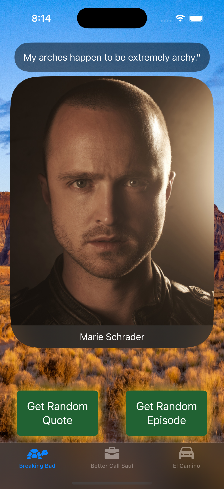
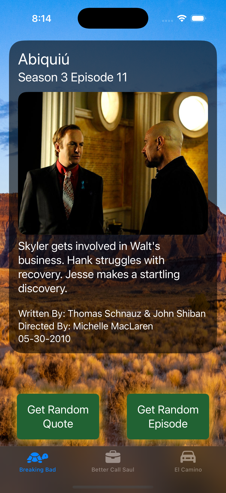
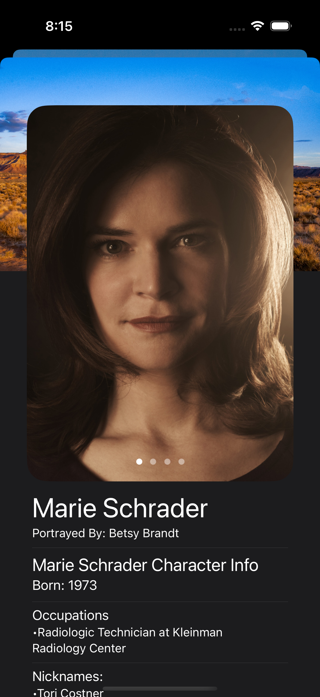
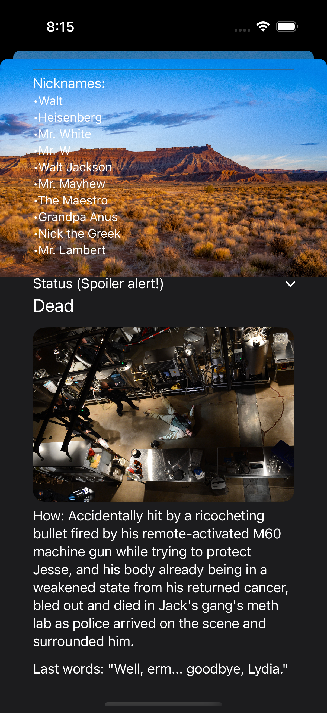
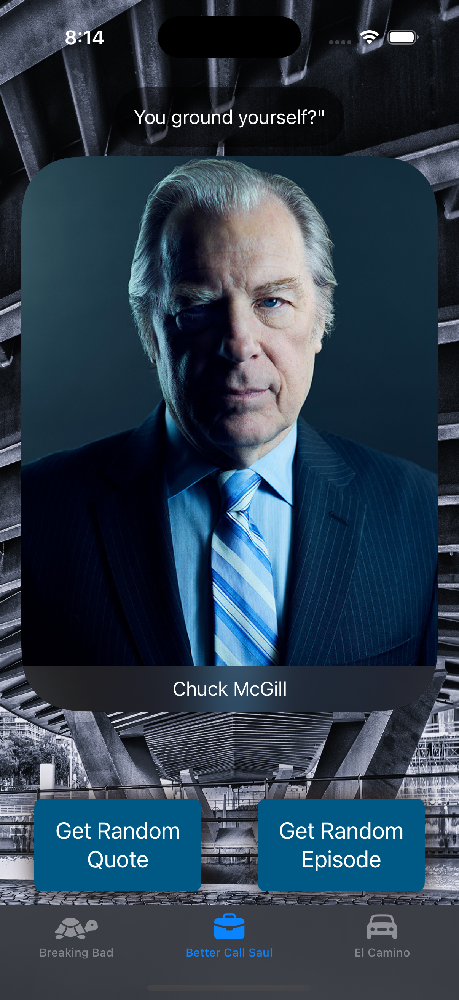
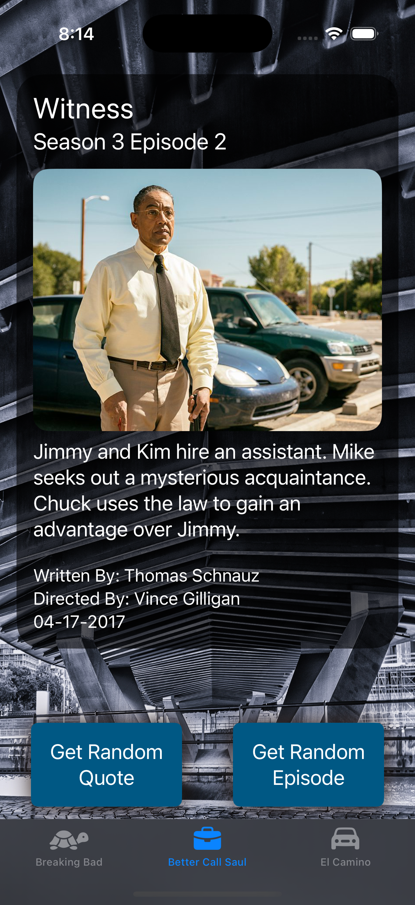
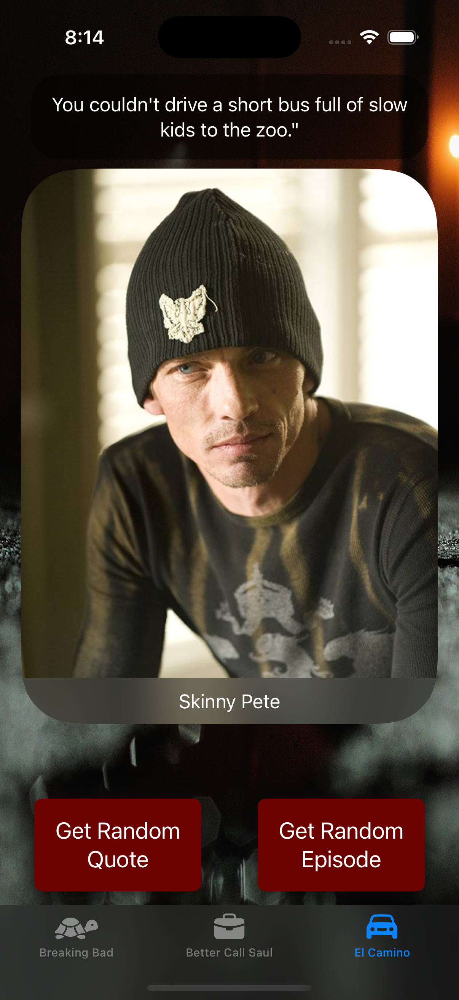
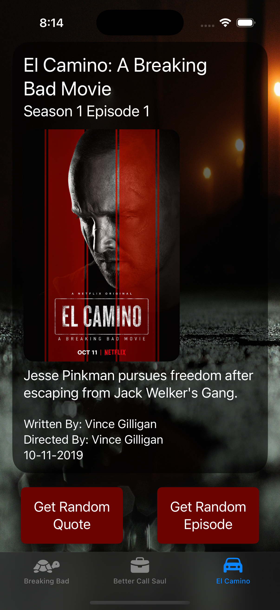

# SwiftUI_BBQuotes

## Overview
The "BB Quotes" app is an iOS application that immerses users in the universes of "Breaking Bad," "Better Call Saul," and "El Camino." It provides detailed character bios, iconic quotes, and high-quality visuals from these series, allowing fans to explore and relive memorable moments. 

## Breaking Bad

&nbsp;&nbsp;&nbsp;
&nbsp;&nbsp;&nbsp;
&nbsp;&nbsp;&nbsp;
&nbsp;&nbsp;&nbsp;

## Better Call Saul

&nbsp;&nbsp;&nbsp;
&nbsp;&nbsp;&nbsp;

## El Camino

&nbsp;&nbsp;&nbsp;
&nbsp;&nbsp;&nbsp;

## Key Features 
-> Explore detailed biographies and images of characters from the Breaking Bad universe.
-> Get memorable quotes from the series with a simple tap.
-> Discover a randomly selected episode effortlessly.
-> Designed for a seamless and visually engaging user experience.
-> Easily switch between different series in the universe.

## Technology Stack 🛠️
Swift: Core programming language for development.
UIKit & SwiftUI: Used to craft a smooth, responsive, and modern UI.
MVVM Architecture: Maintains a clean and scalable code structure.
Xcode: The primary tool for building and testing the application.

Based on the Udemy course [iOS 18, SwiftUI 6, & Swift 6: Build iOS Apps From Scratch](https://www.udemy.com/course/ios-15-app-development-with-swiftui-3-and-swift-5/).
